# Goodreads-like Application

## Overview
This is a web application inspired by Goodreads, built using **Java Spring Boot**, **Thymeleaf**, and **MySQL**. Users can browse books, leave comments, and manage their reading lists. The application includes user authentication, an admin panel, and various user interactions.


## Technologies Used
- **Backend**: Java Spring Boot
- **Frontend**: Thymeleaf, HTML, CSS
- **Database**: MySQL
- **Authentication**: Spring Security
- **Build Tool**: Maven

  
## Features
### User Features:
- User registration and login
- Edit personal details
- Delete account
- Browse books
- Leave comments on books
- Mark books as "To Read"

### Admin Features:
- Add and remove books
- Manage user accounts
- Delete inappropriate comments
- View statistics

## Installation & Setup
### Prerequisites
- Java 17+
- MySQL database
- Maven

### Steps to Run the Application
1. Clone the repository:
   ```sh
   git clone https://github.com/mariakoren/goodreads.git
   cd goodreads
   ```
2. Configure MySQL database:
   - Update `application.properties` with your MySQL credentials.
3. Build and run the project:
   ```sh
   mvn spring-boot:run
   ```
4. Open your browser and go to:
   ```sh
   http://localhost:8080
   ```


## Demo GIF


## Screenshots
Below are some previews of the application:

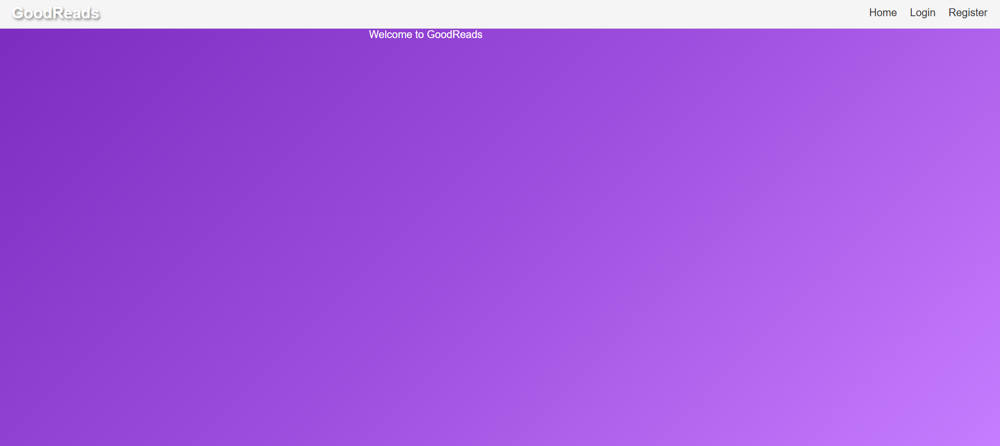
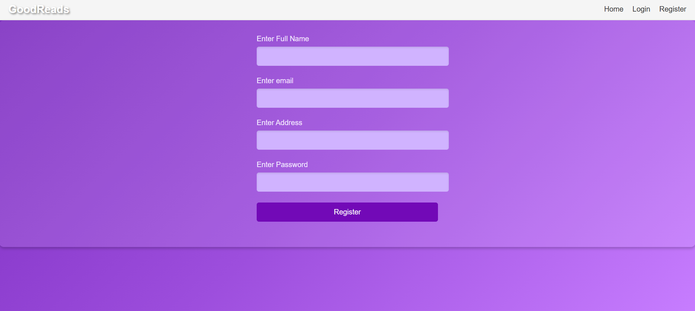
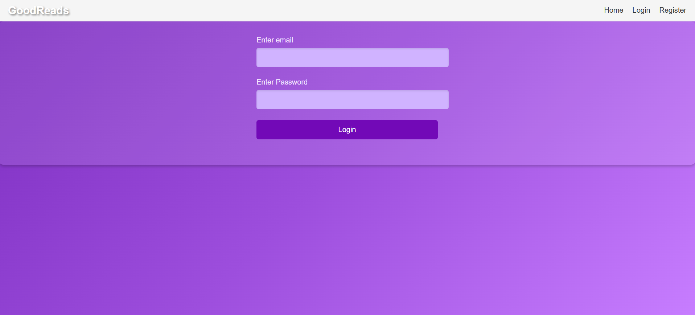
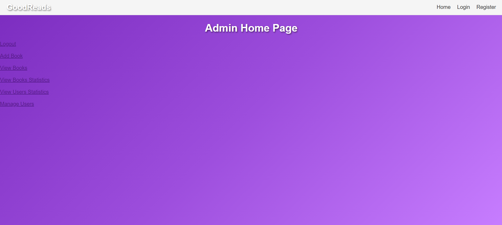
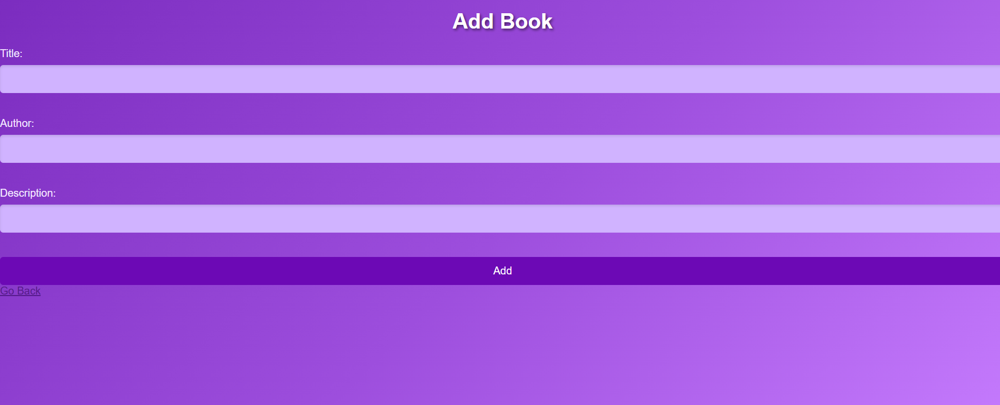
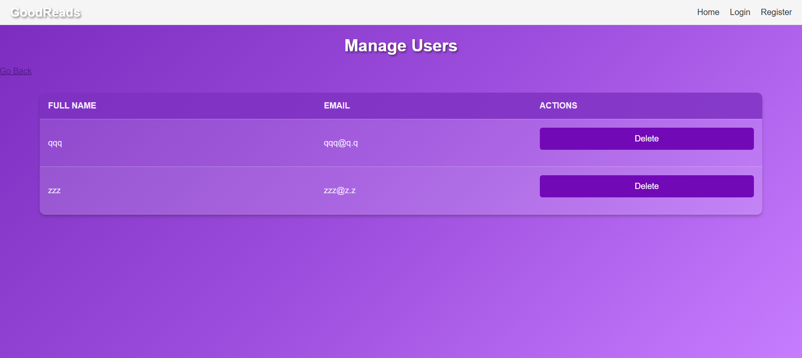
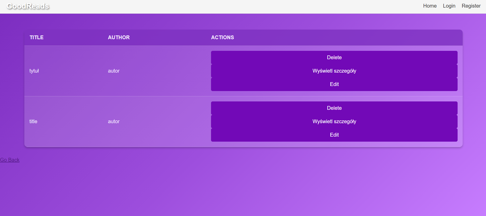
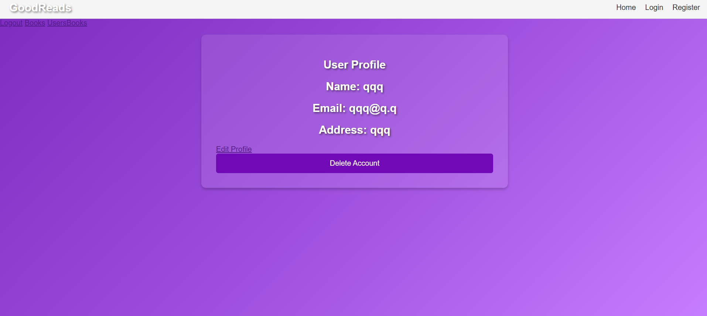
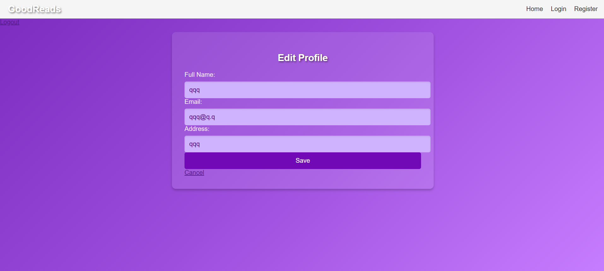
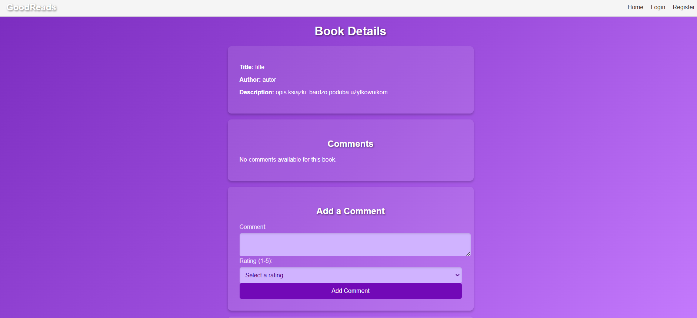
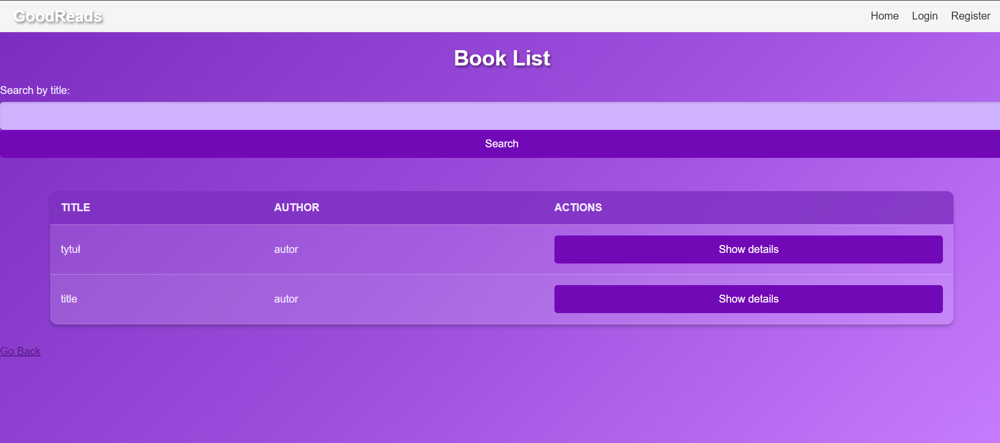
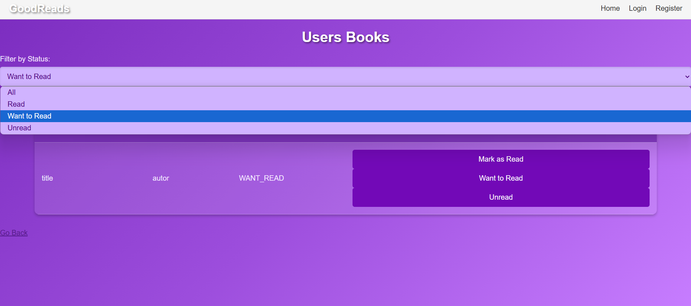
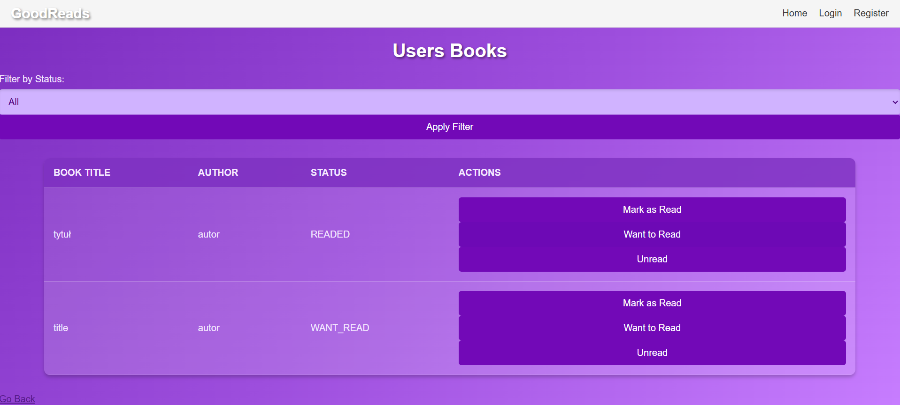


